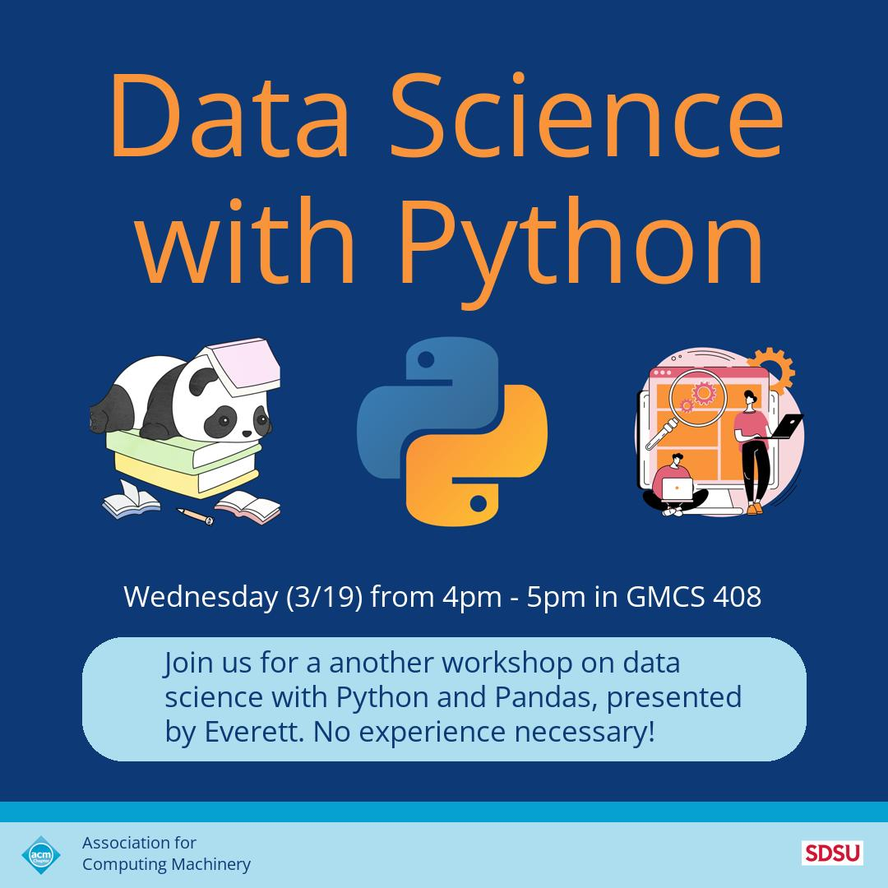

#DESIGN

**A markup language used to create custom graphics.**

Design will be used to create custom graphics, including business cards, letters, email signatures, lists, posters, weekly calendars, and more. It was created to resemble a mix between LaTeX and Canva. To create something, you can use one of the premade templates or opt to create your own template. Each template uses json syntax so you can easily save and share templates or elements with friends.

**Features:**

- Create custom graphics with precision.
- Create a variety of creations like a poster, letter, busniess card, instagram post, or email signature.
- Share templates with friends as a json file.
- Save your favorite schemes all in one json file.

**Sample Designs**

**[Slides](https://docs.google.com/presentation/d/e/2PACX-1vQ-KVyJVL48ljSjir4e1_9N5ExQCMaYuDs6CMw85Eu4rKqFor12qlfDj0kpkHPJQuP8ubOmhfEr7eNy/pub?start=false&loop=false&delayms=3000)**
